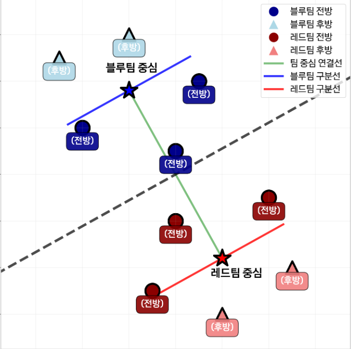

## 전투 없이 예측하는 시뮬레이션의 힘

## 문제 설명
유닛의 초기 배치 정보만으로 승패를 예측하는 머신러닝 모델을 AI를 활용해 개발해 보세요.

당신은 신규 전투 시뮬레이션 게임의 핵심인 밸런스 패치팀에 합류했습니다. 우리 팀의 목표는 수만 번의 가상 전투를 실행하고 그 결과를 분석하여 완벽한 게임 밸런스를 맞추는 것입니다.

업무 효율을 극대화하기 위해, 실제 전투를 모두 실행하는 대신 유닛의 초기 배치만으로 승패를 예측하는 머신러닝 모델을 개발하고자 합니다. 유닛의 세부 능력치는 베일에 싸여 있으며, 오직 유닛의 종류(type)와 2차원 좌표(x, y)만으로 전장의 판세를 읽어야 합니다.

## 전투 환경 설명
유닛: 전투에 투입되는 개체. 총 5종의 유닛이 있고, 유닛 타입별로 상성이 다르다.
팀의 중심: 각 팀의 유닛들의 좌표값들의 평균
전투의 전방: 두 팀 중심을 잇는 선분을 기준 축으로 삼고, 그 수직이등분선을 경계로 한다.
전방: 경계선 기준 상대 팀 중심 쪽 반평면에 위치한 유닛
후방: 그 반대쪽 반평면
좌표의 중심: 유닛이 배치되는 공간은 x축과 y축 모두 [1, 20]의 범위를 갖는다. 따라서 좌표 공간의 기준 중심은 (10.5, 10.5)로 계산된다.

## 유의사항
별도의 검증 데이터셋은 제공되지 않습니다. 훈련 데이터셋을 적절히 나누어 모델 성능을 검증하세요.
문제 관련 정보
데이터 특징 공학 (Feature Engineering): 훈련 데이터를 분석하여 전투 상황을 가장 잘 나타내는 특징(Feature)을 추출하고 가공합니다.
예시: 팀별 유닛 수, 특정 타입의 유닛 수, 유닛 간 평균 거리, 특정 유닛에 대한 공격 집중도 등
승패 예측 모델 구현: 추출한 특징을 기반으로 테스트 데이터의 승리팀을 예측하는 분류(Classification) 모델을 개발합니다.

## 문제자료
ai_top_100_modeling.zip
위 파일을 다운로드하여 압축 해제하면 두 개의 파일을 확인할 수 있습니다.

train_battles.json: 훈련 데이터셋
test_battles.json: 6번 문항 문제 데이터셋
train_battles.json

파일은 json 형식으로 구성되어 있으며, ai_top_100_modeling 폴더에 있습니다.

1:1, 2:2, 3:3, 4:4 전투로 구성된 29,000건의 전투 시뮬레이션 데이터
주요 속성:
id: 전투 고유 ID
blue, red: 팀별 유닛 정보 배열
unit_id: 유닛 고유 ID
type: 유닛 종류 (aleo, bras, cbene, dgreg, eyanoo)
at: 유닛의 2차원 좌표(x, y) (예: "9,0")
winner: 해당 전투의 승리팀 ("blue" 또는 "red")
test_battles.json

500건의 전투 시뮬레이션 데이터
훈련 데이터셋과 구조는 동일하지만, winner 필드가 없습니다.
6번 문항 풀이시 이 데이터셋의 승자를 예측해야 합니다.
배점 및 채점 기준
총점: 85점

문항 1~3: 각 5점
문항 4, 5: 각 10점
문항 6: 50점
정확도 60% 부터 80%: 2%당 5점
채점 기준

객관식 다중선택 문항 부분점수 없음

## 1번문제
1v1 최강자는?

1대1 전투에서 가장 높은 승률을 자랑하는 유닛 타입을 고르세요.

aleo
bras
cbene
dgreg
eyanoo

## 2번 문제
배치 효과

전투의 전방에 배치되었을 때와 후방에 배치되었을 때 승률 차이가 가장 많이 나는 유닛은 무엇인가요?

aleo
bras
cbene
dgreg
eyanoo

## 3번문제 

진형 우세 예측

전체 훈련 데이터를 기준으로, 유닛들이 가로로 넓게 퍼진 진형(x축 방향으로 긴 진형)과 세로로 길게 늘어선 진형(y축 방향으로 긴 진형) 중 어느 쪽이 더 높은 승률을 보이나요?

x 방향으로 긴 진형
y 방향으로 긴 진형

## 4번문제 
상성 관계

유닛 간 우위가 결정되는 상성 관계는 A > B (A가 B를 이김)와 같이 표기합니다.

예를 들어, 우리에게 익숙한 '가위바위보'는 가위 > 보, 보 > 바위, 바위 > 가위의 상성을 가집니다.

다음 중, 상성 관계에 대한 설명으로 옳지 않은 것을 고르세요.

* 복수 선택입니다

dgreg > aleo
cbene > eyanoo
bras > cbene
aleo > bras
cbene > aleo
aleo > eyanoo
bras > dgreg
eyanoo > bras
dgreg > cbene
eyanoo > dgreg

## 5번문제 
다음 중 train_battles.json에서 확인할 수 있는 내용으로 올바르지 않은 것은 무엇인가요?

* 복수 선택입니다

4대4 전투에서, aleo+bras+dgreg+eyanoo 조합의 승률은 60% 이상이다.
팀의 중심이 좌표의 중심(10.5, 10.5)에 가까울 수록 승률이 높다.
2대2 전투에서 aleo+dgreg 조합은 bras+eyanoo 조합에게 26전 25승을 기록했다.
dgreg는 전방에 위치할 때가 후방에 위치할 때보다 승률이 높다.
같은 팀 유닛 간 거리가 가까울 수록 승률이 높아지는 경향을 보인다.

## 6번문제 
전투 결과 최종 예측

test_battles.json 데이터셋의 모든 전투에 대한 승자를 예측하여 아래 형식에 맞춰 제출해 주세요.

JSON 배열
배열을 구성하는 객체는 개별 전투 예측 객체

예시:
[
  {
    "id": "test_001", 
    "winner": "red"
  },
  {
    "id": "test_002", 
    "winner": "red"
  }
  …
]
